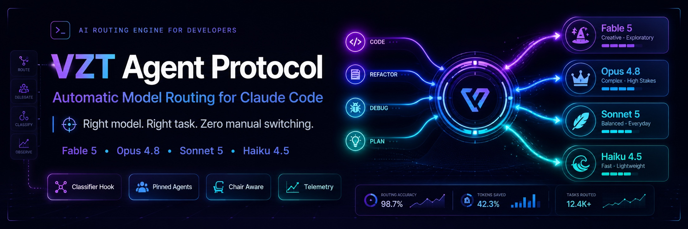

# VZT Agent Protocol



**Automatic model routing for Claude Code — Fable 5, Opus 4.8, Sonnet 5, Haiku 4.5. Right model, right task, zero manual switching.**

Part of the [VZT Tech Consulting Protocol](https://github.com/vonzelle-vzt/VZT-Tech-Consulting-Protocol) ecosystem.

[](LICENSE)
[](#)
[](docs/ROUTING-MATRIX.md)

---

## The problem

Running every prompt on your best model burns through weekly usage limits in
days. Running everything on a cheap model caps quality. Manually flipping
`/model` per task is friction nobody sustains.

## The solution

The VZT Agent Protocol classifies every prompt and routes the work to the
**cheapest model tier that can do it well** — automatically, on every prompt,
with zero API cost for the routing itself:

| Tier | Model | Owns |
|------|-------|------|
| 4 | **Fable 5** | Architecture, planning, impossible bugs, root-cause, security analysis |
| 3 | **Opus 4.8** | Large refactors, dense algorithms, performance surgery, load-bearing review |
| 2 | **Sonnet 5** | Standard implementation — the default (burns its own separate weekly bucket) |
| 1 | **Haiku 4.5** | Search, summaries, renames, formatting, commit messages — nearly free |

**Why this preserves your limits:** Max plans meter a Sonnet-only weekly bucket
*separately* from the all-models bucket that Fable/Opus consume. Routing
execution to Sonnet and mechanical work to Haiku means your premium quota is
spent only where premium reasoning actually changes the outcome.

**Recommended setup — Opus first line:** sit on Opus 4.8 (`/model opus`) so
strong reasoning is always on tap, and let the protocol delegate routine builds
*down* to Sonnet and mechanical work *down* to Haiku, reaching *up* to Fable only
on the ~15% of turns that are genuinely frontier-hard. See
[Chair Profiles](docs/CHAIR-PROFILES.md) for every chair's behavior.

## Quick start

No clone needed — run it straight from GitHub with `npx`:

```bash
# install globally for every project
npx github:vonzelle-vzt/vzt-agent-protocol install --global

# or install into a single project's .claude/
npx github:vonzelle-vzt/vzt-agent-protocol install --target /path/to/your/project

# verify
npx github:vonzelle-vzt/vzt-agent-protocol doctor --global
```

Or clone first if you prefer:

```bash
git clone https://github.com/vonzelle-vzt/vzt-agent-protocol.git
cd vzt-agent-protocol
node cli/vzt-agent.js install --global   # or: install --target /path/to/project
node cli/vzt-agent.js doctor --global
```

Restart Claude Code. Pick the chair that matches how you work — the protocol
adapts the routing doctrine to it either way:

- **Opus 4.8 chair** (`/model opus`) — build inline, delegate routine execution
  *down* to Sonnet and mechanical work to Haiku, escalate *up* to Fable only for
  hard architecture/debugging. Best when you want strong first-line reasoning on
  tap and Sonnet as your workhorse below it.
- **Sonnet 5 chair** (`/model sonnet`) — most work stays inline on the
  Sonnet-only bucket; escalate *up* to Opus/Fable only when a task earns it.
  Best for maximum quota efficiency.

## How it works — four real routing layers

Every layer here uses a mechanism Claude Code actually enforces — not
prompt-only suggestions:

### 1. Per-prompt classifier hook (`UserPromptSubmit`)
A deterministic, <50ms, zero-API-cost classifier scores every prompt against
the routing matrix (25+ signal patterns + length heuristics) and injects a
`[VZT-ROUTE]` directive: which tier, which agent, whether to handle inline.
Every decision is logged to `~/.claude/vzt-router/decisions.jsonl`.

### 2. Chair-aware session profiles (`SessionStart`)
The protocol reads which model your session launched with and **inverts the
doctrine to match**:
- **Fable chair** → tokens are scarce: plan inline, delegate ALL execution down
- **Opus chair** → clock is scarce: build inline, push mechanical work down
- **Sonnet chair** → capability is scarce: escalate up only when a task earns it
- **Haiku chair** → dispatcher mode: delegate almost everything

### 3. Model-pinned agent fleet (`.claude/agents/`)
Seven agents with `model:` + `effort:` frontmatter — Claude Code runs each on
its pinned model regardless of your session model:

| Agent | Model | Effort | Role |
|-------|-------|--------|------|
| `vzt-planner` | fable | max | Plans with a **step-routing table** (each step tagged with its cheapest sufficient tier) |
| `vzt-oracle` | fable | max | Root-causes impossible bugs; returns a fix packet, not a guess |
| `vzt-heavy-builder` | opus | high | Tightly-coupled multi-file surgery, algorithms, migrations |
| `vzt-reviewer` | opus | high | Reviews **only the load-bearing seam** the plan flags |
| `vzt-builder` | sonnet | medium | The workhorse — all routine implementation |
| `vzt-scout` | haiku | low | Recon: find/count/summarize, read-only |
| `vzt-mechanic` | haiku | low | Mechanical edits: renames, formatting, bumps |

### 4. Turn-level skills (skill `model:` override)
When up- or down-tier work needs the **full conversation context** (subagents
start fresh), these switch the *current turn's* model in place:

- `/vzt-plan <task>` — plan this turn on **Fable 5**
- `/vzt-fix <bug>` — root-cause this turn on **Fable 5**
- `/vzt-build <step>` — execute this turn on **Sonnet 5**
- `/vzt-quick <task>` — mechanical turn on **Haiku 4.5**
- `/vzt-fable-mode` — run this turn under the five frontier working gates
  (scope, evidence, attack, verify, report) (no model pin — runs on the
  active model)
- `/vzt-diagnose <symptom>` — **parallel hypothesis fan-out** for a hard bug:
  N≤4 read-only agents each test one root cause with one real command and
  return CONFIRMED/REFUTED with the output pasted. Run it *before* escalating
  to `/vzt-fix` — cheap parallel evidence first, frontier reasoning only once
  it is earned. (No model pin — the probes run on Haiku/Sonnet.)
- `/vzt-ship <the system to build>` — **spec-first long-horizon execution**:
  writes a SPEC to disk before any code, gates it with a command, then drives
  it as supervised background workers. See
  [Long-horizon work](#long-horizon-work--vzt-ship) below.

The session model returns on your next prompt.

## The standard pipeline

```
you: "build feature X"  (a non-trivial, multi-part feature)
 └─ PLAN → vzt-planner (Fable 5, effort max)   ·   or /vzt-plan for an in-context turn
     └─ plan with step-routing table + load-bearing seam flagged
         ├─ steps tagged sonnet → vzt-builder        (parallel)
         ├─ steps tagged haiku  → vzt-mechanic/scout (parallel)
         ├─ steps tagged opus   → vzt-heavy-builder
         └─ seam review         → vzt-reviewer (Opus, only the risky seam)
```

On an **Opus chair**, a routine one-shot request skips planning entirely — the
classifier delegates the build straight down to `vzt-builder` (Sonnet) and any
mechanical part to `vzt-mechanic` (Haiku), while you stay on Opus as coordinator.
Full walkthroughs per chair: [Chair Profiles](docs/CHAIR-PROFILES.md).

## Long-horizon work — `/vzt-ship`

Scope language ("entire codebase", "from scratch", "greenfield", "end-to-end",
"multi-tenant") used to route straight to Fable — the slower, more expensive
model. That was a bug. Long-horizon work doesn't fail because the model isn't
smart enough; it fails because **context compaction eats the plan halfway
through the run**, and the back half gets built against a plan the chair no
longer remembers. A slower model doesn't fix that. A plan on disk does.

**Escalate the PROCESS, not the MODEL.** Scope language now routes to Opus
under a new task kind, `HORIZON`, and the gate is **two-factor**: scope
language *alone* is still a planning question and stays on Fable ("design the
architecture for the whole system"); scope **+ a build verb**
(build/implement/ship/create/scaffold/rewrite/...) is a shipping question and
becomes `HORIZON`. Fable narrows to genuinely hard debugging (`/vzt-fix`) and
stays ≤15% of turns.

A `HORIZON` classification points at `/vzt-ship`, which runs four phases:

1. **SPEC** — forbidden from editing source. Writes `.vzt/ship/<slug>/SPEC.md`
   from `templates/spec.md`: contract, out-of-scope, the interfaces that
   cross unit boundaries (these become a serial "barrier" unit), a file
   manifest, and units whose `FILES_IN_SCOPE` sets are pairwise disjoint, each
   with one machine-checkable oracle chosen *before* the unit is built.
2. **GATE** — `vzt-agent ship-check <SPEC.md>` is a command, not an opinion:
   it exits non-zero on overlapping scopes, a manifest file no unit owns, a
   unit with no oracle, or an unknown agentType.
3. **RUN** — launches `workflows/vzt-ship.js` via the Workflow tool: barrier →
   parallel units → independent read-only verification of each oracle
   (builders never grade themselves) → bounded repair (≤2 rounds) →
   integration gate.
4. **LAND** — verifies artifacts on disk, not reports, then stops before
   commit/deploy.

It survives compaction because the coherence lives on disk, not in the
conversation: `SPEC.md` + `LEDGER.jsonl` on disk, `vzt-agent ship-status`
reconstructs run state, and the `UserPromptSubmit` classifier hook re-injects
a `[VZT-SHIP]` block on every prompt — compaction does not re-fire
`SessionStart`, so the classifier is the only hook that survives it.

### Optional: watch a run in an agent multiplexer (`orca/`)

`workflows/vzt-ship.js` is the headless path. When you'd rather **watch** the units
work in parallel — live panes, diffs, agent state — the same gated `SPEC` drives a
**supervised** run in an agent multiplexer. Three backends behind one `--mux` flag:
[`orca`](https://github.com/stablyai/orca) (desktop ADE, default),
[`herdr`](https://herdr.dev) (terminal-native, persistent over SSH/mobile), or
`vscode` (each unit opens as a **native VS Code integrated terminal** via the
companion extension in [`vscode/`](vscode/) — no external binary, just VS Code):

```
vzt-agent ship-watch .vzt/ship/<slug>/SPEC.md               # orca (default)
vzt-agent ship-watch .vzt/ship/<slug>/SPEC.md --mux herdr   # herdr
vzt-agent ship-watch .vzt/ship/<slug>/SPEC.md --mux vscode  # native VS Code terminals
```

The `vscode` backend needs no multiplexer install: it uses `git worktree` + a
filesystem queue the companion extension drains into terminals, and a `Stop` hook
for idle detection. Setup + the honest constraints (VS Code can't rename terminal
tabs, so PASS/FAIL shows in a "VZT Ship" output channel + status bar) are in
[`docs/VSCODE.md`](docs/VSCODE.md).

One command: dispatch every unit as a `claude` worktree pane → wait for each to finish
→ auto-run its oracle, stamp its card, record the ledger → integration gate → stop at
"ready to review + merge". Each pane is auto-bootstrapped (`orca/worktree-bootstrap.sh`
symlinks `node_modules`/`.env*` from the primary checkout, so a worktree can actually
build), and the ledger resolves to the **primary checkout** so parallel worker writes
are never lost or conflicted. This is *not* the fan-out that `vzt-route` rejects — the
units are pairwise-disjoint, not a race. Full guide: [`orca/README.md`](orca/README.md).

## Guardrails

- **Escalation ladder** — two failures at a tier escalates exactly one tier
  (haiku→sonnet→opus→fable), stated aloud. Under-routing is self-healing.
- **Fable budget** — ≤15% of turns; `vzt-agent stats` shows your distribution
  against the target.
- **No frontier execution** — plans always hand execution to cheaper tiers.
- **Advisory, not authoritarian** — directives are context injections; Claude
  overrides them only with a stated reason.

## Manual overrides

| Input | Effect |
|-------|--------|
| `@fable` / `@opus` / `@sonnet` / `@haiku` prefix | Force a tier for that prompt |
| `~` prefix | Bypass routing for that prompt |
| `/vzt-route <task>` | Ask for an explicit routing decision |
| `/vzt-route stats` | Tier distribution vs. targets |

## CLI

```bash
vzt-agent install [--global] [--target <dir>]   # install + wire settings.json
vzt-agent uninstall [--global] [--target <dir>] # clean removal
vzt-agent doctor [--global]                     # health check
vzt-agent stats                                 # routing decision distribution
vzt-agent matrix                                # print the routing matrix
vzt-agent ship-check <SPEC.md>                  # gate a /vzt-ship spec — disjoint scopes, an oracle per unit
vzt-agent ship-start <SPEC.md>                  # open the run ledger for a gated spec
vzt-agent ship-note  <SPEC.md> '<json>'         # append one ledger line
vzt-agent ship-status [--target <dir>]          # reconstruct run state from disk (use after a compaction)

# Supervision layer (optional — parallel /vzt-ship runs in an agent multiplexer)
#   --mux orca (default) | herdr | vscode (native VS Code terminals; see docs/VSCODE.md)
vzt-agent ship-watch    <SPEC.md> [--mux orca|herdr|vscode] [--timeout-ms <n>]  # kick once: dispatch → wait → verify → gate
vzt-agent ship-dispatch <SPEC.md> [--mux orca|herdr|vscode] [--execute]        # one worktree+claude per unit
vzt-agent ship-supervise <SPEC.md> [--mux orca|herdr|vscode]                   # verify each oracle → shared ledger + mux card
```

Get the bare `vzt-agent` command with `npm install -g github:vonzelle-vzt/vzt-agent-protocol`,
or prefix any of the above with `npx github:vonzelle-vzt/vzt-agent-protocol`
(from a clone: `node cli/vzt-agent.js`).

## The process is the moat — the five Fable layers

Model choice alone isn't the whole story — the working discipline riding on
top of it is. `/vzt-fable-mode` extracts the frontier tier's working process
into **five gates** any tier can run. Each gate is a checkpoint the work must
pass *before* moving on; skipping one turns the output into a guess, no matter
which model produced it. A cheaper model running these gates beats a frontier
model running none. The canonical long form lives in
[`skills/vzt-fable-mode/SKILL.md`](skills/vzt-fable-mode/SKILL.md).

### Gate 1 — Scope before you act

State the plan before touching anything: what the brief actually asks for, the
smallest change that satisfies it, and what is explicitly out of scope. Then
play devil's advocate against your own plan once — list the unknowns and
assumptions it rests on, and for each one say how you'll resolve it (read the
file, run the command, ask). A plan whose unknowns are named is a plan; one
without them is a guess with steps.

### Gate 2 — Evidence before reasoning

Never reason about code you haven't looked at this session. Confirm files,
symbols, APIs, and flags exist — read/grep them — before building on them.
What the model remembers from training or an earlier session is a hypothesis,
not evidence: partial recognition does not mean current knowledge, and a
prompt implying a file exists does not mean one does. Verify, then reason.

### Gate 3 — Attack your own approach

Before executing, try once to break the plan: what input, state, or ordering
makes it wrong? What's the strongest argument this is the trigger and not the
cause? Name the evidence that would refute the approach and go check it. If
the attack lands, fix the plan now — it is exponentially cheaper than fixing
the shipped version.

### Gate 4 — Verify before declaring done

Every change gets a machine-checkable oracle — a test, a command, a curl, a
rendered page — decided *before* the change is made, not invented after.
Run it and paste the actual output. "Should work," "looks correct," and a
green typecheck are not verification; behavior observed end-to-end is. If the
oracle can't be run, say so explicitly instead of implying it was.

### Gate 5 — Report only what you verified

No claim in the report that wasn't checked. Anything unverified is marked
unverified or dropped — a finding you can't walk through end-to-end is a
guess. An honest partial report ("3 done, 1 blocked on X") beats a padded
complete-sounding one every time. Failures are stated plainly, with the
output that shows them.

### Why gates, not effort

The gates are about *process*, not *effort*: raising the effort dial does not
compensate for a skipped gate — a skipped gate at max effort is still a guess.
They also scale down: on Haiku each gate is one line of output; the discipline
is identical, the prose is shorter. Combined with the orchestrator doctrine
(frontier designs and verifies, Sonnet/Haiku execute and report back), this is
what delivers the ~8–25× lower cost on routine steps at equal quality. The
Cost/Intelligence/Taste columns in the [routing matrix](docs/ROUTING-MATRIX.md)
quantify that trade-off tier by tier, so the routing decision is a number, not
a vibe.

### How fable-mode activates

- **Always on at the Opus tier** — Opus never runs bare. Every Opus surface
  carries the five gates by default: the `vzt-heavy-builder` and `vzt-reviewer`
  agents state them as their first rule, the Opus chair profile injects them at
  session start, and every `[VZT-ROUTE]` directive that targets Opus restates
  them. Opus stays Opus (no model change) — it just always works with Fable's
  process. Frontier discipline, cheaper model.
- **Automatic in fleet executors** — `vzt-builder` and `vzt-mechanic` carry the
  gate summary as Rule 1, so anything the router delegates to them runs the
  gates with no user action. `vzt-planner` and `vzt-oracle` (Fable) don't
  reference it — they're the source of the doctrine, not a consumer of it.
- **Manual on the chair** — `/vzt-fable-mode <task>` loads the full skill into
  the current turn, the "elevate Sonnet" move for hard inline work. The
  model may also auto-invoke it when a task obviously calls for the discipline,
  but the slash command is the guaranteed path. Skip it for routine one-liners
  — the gates would just add overhead.
- **No model pin, by design** — unlike `/vzt-plan`/`/vzt-fix` (force Fable),
  `/vzt-build` (Sonnet), and `/vzt-quick` (Haiku), fable-mode runs on whatever
  model is already active. It changes *how* the current model works, not
  *which* model works: the router picks the tier and effort, fable-mode
  upgrades the discipline of whichever tier got picked. The two dials are
  independent.

## Requirements

- Claude Code ≥ 2.1.170 (skill/agent `model:` frontmatter incl. `fable` alias)
- Node.js ≥ 18
- A plan with access to Fable 5 (falls back gracefully: `availableModels`
  restrictions make blocked tiers inherit the session model)

## Docs

- [Chair profiles — Opus-first, Sonnet-first, Fable, Haiku](docs/CHAIR-PROFILES.md)
- [Routing matrix + decision procedure](docs/ROUTING-MATRIX.md)
- [Orca supervision layer — watch a /vzt-ship run in Orca](orca/README.md)
- [CLAUDE.md snippet for manual installs](templates/CLAUDE-snippet.md)

## Release notes

### 1.8.0 — Herdr-supervised runs are the DEFAULT substrate for `/vzt-ship`

- The `/vzt-ship` skill now drives supervised runs in a **live agent multiplexer by
  default** — when `vzt-agent` is on `PATH` and a mux is live, run
  `vzt-agent ship-watch <SPEC.md>` so each unit is a real `claude` agent in a
  watchable/attachable worktree pane (Herdr via `VZT_MUX=herdr`; omit `--mux`). The
  headless Workflow tool becomes the **fallback** (no mux live / `vzt-agent` off
  `PATH`) — resumable but not watchable; the skill says which driver it used. This
  ships in the files `install()` copies (`skills/vzt-ship/SKILL.md` +
  `hooks/vzt-session-start.mjs`), so every project pulls the default in on install —
  no per-repo `CLAUDE.md` edit needed.
- `ship-watch` still STOPS at the green integration gate; **never auto-merges**.
- Test isolation fix: the `ship-dispatch` default-mux test now clears `VZT_MUX` from
  the child env before asserting the code default (orca), and separately asserts that
  `VZT_MUX=herdr` makes herdr the default with no `--mux`. Prevents a machine-wide
  `export VZT_MUX=herdr` from turning the suite red. 70/70 tests.

### 1.7.0 — Herdr backend (agent-multiplexer supervision, `--mux`)

- The supervision layer is now **multiplexer-agnostic** via `--mux orca|herdr`
  (default `orca`). Added **Herdr** ([herdr.dev](https://herdr.dev)) — a
  terminal-native agent multiplexer (a binary, persistent over SSH/mobile) — as a
  second backend. `ship-watch`/`ship-dispatch`/`ship-supervise` all take `--mux`.
- Refactored the Orca-specific code into a **5-method backend interface**
  (dispatch / waitIdle / resolve / stamp / plan). The Orca path is unchanged;
  `worktree-bootstrap.sh` and the primary-checkout ledger resolution are already
  mux-agnostic.
- Herdr prerequisites (one-time): `brew install herdr`, `brew services start herdr`,
  `herdr integration install claude` (so claude reports state → `herdr agent wait`).
  Verified live: worktree resolution, oracle-in-worktree, and workspace-label
  stamping (`orca` card / `herdr workspace` label). 68/68 tests green.

### 1.6.0 — Orca supervision layer

- **Orca accepted as a `/vzt-ship` *supervision* layer** (not fan-out — that stays
  rejected; these units are pairwise-disjoint, not a race). The terminal-native
  protocol is unchanged; Orca just runs `claude`, so routing/hooks/subagents/skills
  inherit as-is. Reserve Orca for parallel ship runs.
- New CLI: **`ship-watch`** (kick once — dispatch every unit as an Orca `claude`
  pane → wait for each → auto oracle + card + ledger → integration gate → stop at
  "ready to review + merge"; never auto-merges), **`ship-dispatch`** (the commands,
  dry-run or `--execute`), **`ship-supervise`** (verify each oracle → shared ledger
  + Orca card). Installed to `~/.orca/vzt/` alongside `orca/worktree-bootstrap.sh`.
- **`worktree-bootstrap.sh`** symlinks `node_modules`/`.env*` from the primary
  checkout into each worktree — closing the "a worktree can't build" objection *for
  the supervised case*.
- **Ledger coherence fix:** `ship-note`/`ship-status` now resolve `LEDGER.jsonl` to
  the **primary checkout** (`git worktree list` first entry). `.vzt/ship/` is
  git-tracked, so worktrees used to fork their own ledger — worker writes were lost
  and branches conflicted. Byte-identical in a plain checkout.
- See [`orca/README.md`](orca/README.md) and `skills/vzt-route/SKILL.md` →
  "Accepted — Orca as the ship SUPERVISION layer".

### 1.5.0 — long-horizon release

- **Doctrine shift — "Escalate the PROCESS, not the MODEL."** Scope language
  ("entire codebase", "from scratch", "greenfield", "end-to-end",
  "multi-tenant") no longer routes to Fable. It now routes to Opus under a
  new `HORIZON` task kind, gated **two-factor**: scope language alone stays a
  planning question on Fable; scope **+ a build verb** becomes `HORIZON` and
  points at `/vzt-ship`.
- New skill `/vzt-ship` — spec-first long-horizon execution. SPEC (no code) →
  GATE (`vzt-agent ship-check`, a command not an opinion) → RUN (barrier →
  parallel units → independent oracle verification → bounded repair →
  integration gate, via the Workflow tool) → LAND (verify artifacts on disk,
  stop before commit/deploy). Survives compaction: `SPEC.md` + `LEDGER.jsonl`
  on disk, and the classifier hook re-injects a `[VZT-SHIP]` block on every
  prompt since compaction doesn't re-fire `SessionStart`.
- New CLI commands: `ship-check`, `ship-start`, `ship-note`, `ship-status`.
- See [Long-horizon work](#long-horizon-work--vzt-ship) above.

### 1.3.0 — 2026-07-08

- **Fable discipline is now always on at the Opus tier.** The five fable-mode
  gates (scope, evidence, attack, verify, report) are wired into every Opus
  surface: `vzt-reviewer` now carries them (previously only the builders did),
  the Opus chair profile injects them at session start, and Opus-targeted
  `[VZT-ROUTE]` directives restate them. Model routing is unchanged — Opus
  runs on Opus 4.8, but always with the frontier tier's working process.
- New sync test asserting every Opus surface (both agents, the chair profile,
  the classifier directive) carries the gates.
- README now documents all five gates in full ([The process is the moat —
  the five Fable layers](#the-process-is-the-moat--the-five-fable-layers))
  and leads the quick start with the zero-clone `npx github:` install.
- README cleanup: removed the third-party comparison section.

### 1.2.0 — 2026-07-08

- Added worker-brief delegation doctrine: `templates/worker-brief.md` is the
  canonical template (TASK/CONTEXT/FILES_IN_SCOPE/OPERATION/ACCEPTANCE/
  MACHINE_CHECK/EXPECT/CONSTRAINTS/REPORT).
- **Collision boundary**: FILES_IN_SCOPE in a brief is a hard write boundary —
  `vzt-builder`, `vzt-mechanic`, and `vzt-heavy-builder` now all STOP and
  report rather than expanding scope if the task needs a file outside it.
- **Machine-checkable acceptance**: `vzt-planner`'s step-routing table now
  carries a `machine_check` command per step, chosen at plan time, not
  invented by the worker after the fact.
- **Reporting ≠ persistence**: the `SessionStart` hook's Fable/Opus chair
  profiles and `skills/vzt-route/SKILL.md` now tell the orchestrator to verify
  worker artifacts on disk (git diff, re-run the check) before accepting a
  completion report.
- Added a sync test asserting the template, the three worker agents, and the
  routing skill all carry the new contract.

### 1.1.0 — 2026-07-07

- Added the `vzt-fable-mode` skill: the frontier tier's five working gates
  (scope, evidence, attack, verify, report) extracted into a portable process
  any tier can run — cited as a new rule 1 in `vzt-builder`, `vzt-heavy-builder`,
  and `vzt-mechanic`.
- Effort is now a routing dimension: the classifier computes a suggested
  effort (`suggestEffort()`) per prompt and surfaces it in every `[VZT-ROUTE]`
  directive (`@ effort low|medium|high`), alongside an effort note explaining
  when not to reach for `xhigh`/`max`.
- Added Cost/Intelligence/Taste columns to `TIERS` in the classifier hook, with
  matching columns in `docs/ROUTING-MATRIX.md` and `skills/vzt-route/SKILL.md`
  — a sync test now enforces the cost values match across all three.
- Added orchestrator doctrine (frontier designs and verifies; Sonnet/Haiku
  execute and report back) to `vzt-planner`, `skills/vzt-route/SKILL.md`, the
  `SessionStart` hook's Fable/Opus profiles, and the CLAUDE.md snippet.

## License

MIT © VZT Tech Consulting
