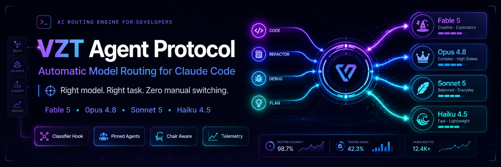

# VZT Agent Protocol



**Automatic model routing for Claude Code — Fable 5, Opus 5, Sonnet 5, Haiku 4.5. Right model, right task, zero manual switching.**

Part of the [VZT Tech Consulting Protocol](https://github.com/vonzelle-vzt/VZT-Tech-Consulting-Protocol) ecosystem.

[](LICENSE)
[](#)
[](docs/ROUTING-MATRIX.md)

---

## The problem

Running every prompt on your best model burns through weekly usage limits in
days. Running everything on a cheap model caps quality. Manually flipping
`/model` per task is friction nobody sustains.

## The solution

The VZT Agent Protocol classifies every prompt and routes the work to the
**cheapest model tier that can do it well** — automatically, on every prompt,
with zero API cost for the routing itself:

| Tier | Model | Owns |
|------|-------|------|
| 4 | **Fable 5** | No-prior-art architecture, impossible bugs, root-cause, security analysis |
| 3+ | **Opus 5** @ `max` | Routine planning — architecture, specs, roadmaps, migration plans (the `opus@max` rung) |
| 3 | **Opus 5** | Large refactors, dense algorithms, performance surgery, load-bearing review |
| 2 | **Sonnet 5** | Standard implementation — the default (burns its own separate weekly bucket) |
| 1 | **Haiku 4.5** | Search, summaries, renames, formatting, commit messages — nearly free |

**Why this preserves your limits:** Max plans meter a Sonnet-only weekly bucket
*separately* from the all-models bucket that Fable/Opus consume. Routing
execution to Sonnet and mechanical work to Haiku means your premium quota is
spent only where premium reasoning actually changes the outcome.

**Recommended setup — Opus first line:** sit on Opus 5 (`/model opus`) so strong
reasoning is always on tap, and let the protocol delegate routine builds *down*
to Sonnet and mechanical work *down* to Haiku, reaching *up* to Fable only on the
≤10% of turns that are genuinely frontier-hard. Opus 5 is a step change on deep
reasoning at half Fable's cost, so planning now runs on the `opus@max` rung
rather than the frontier tier. See [Chair Profiles](docs/CHAIR-PROFILES.md) for
every chair's behavior.

## Quick start

No clone needed — run it straight from GitHub with `npx`:

```bash
# install globally for every project
npx github:vonzelle-vzt/vzt-agent-protocol install --global

# or install into a single project's .claude/
npx github:vonzelle-vzt/vzt-agent-protocol install --target /path/to/your/project

# verify
npx github:vonzelle-vzt/vzt-agent-protocol doctor --global
```

Or clone first if you prefer:

```bash
git clone https://github.com/vonzelle-vzt/vzt-agent-protocol.git
cd vzt-agent-protocol
node cli/vzt-agent.js install --global   # or: install --target /path/to/project
node cli/vzt-agent.js doctor --global
```

Restart Claude Code. Pick the chair that matches how you work — the protocol
adapts the routing doctrine to it either way:

- **Opus 5 chair** (`/model opus`) — build *and plan* inline, delegate routine
  execution *down* to Sonnet and mechanical work to Haiku, escalate *up* to Fable
  only for no-prior-art architecture and impossible bugs. Best when you want
  strong first-line reasoning on tap and Sonnet as your workhorse below it.
- **Sonnet 5 chair** (`/model sonnet`) — most work stays inline on the
  Sonnet-only bucket; escalate *up* to Opus/Fable only when a task earns it.
  Best for maximum quota efficiency.

## How it works — four real routing layers

Every layer here uses a mechanism Claude Code actually enforces — not
prompt-only suggestions:

### 1. Per-prompt classifier hook (`UserPromptSubmit`)
A deterministic, <50ms, zero-API-cost classifier scores every prompt against
the routing matrix (25+ signal patterns + length heuristics) and injects a
`[VZT-ROUTE]` directive: which tier, which agent, whether to handle inline.
Every decision is logged to `~/.claude/vzt-router/decisions.jsonl`.

### 2. Chair-aware session profiles (`SessionStart`)
The protocol reads which model your session launched with and **inverts the
doctrine to match**:
- **Fable chair** → tokens are scarce: plan inline, delegate ALL execution down
- **Opus chair** → clock is scarce: build inline, push mechanical work down
- **Sonnet chair** → capability is scarce: escalate up only when a task earns it
- **Haiku chair** → dispatcher mode: delegate almost everything

### 3. Model-pinned agent fleet (`.claude/agents/`)
Ten agents with `model:` + `effort:` frontmatter — Claude Code runs each on
its pinned model regardless of your session model:

| Agent | Model | Effort | Role |
|-------|-------|--------|------|
| `vzt-planner` | fable | max | **No-prior-art** plans only — novel/greenfield architecture, one-way-door distributed-systems calls |
| `vzt-oracle` | fable | max | Root-causes impossible bugs; returns a fix packet, not a guess |
| `vzt-architect` | opus | max | **The `opus@max` rung** — routine planning, with a **step-routing table** (each step tagged with its cheapest sufficient tier) |
| `vzt-heavy-builder` | opus | high | Tightly-coupled multi-file surgery, algorithms, migrations |
| `vzt-reviewer` | opus | high | Reviews **only the load-bearing seam** the plan flags |
| `vzt-art-director` | opus | high | **Authors `DESIGN.md`** — visual taste, when none is written down yet |
| `vzt-builder` | sonnet | medium | The workhorse — all routine implementation |
| `vzt-stylist` | sonnet | medium | **Applies `DESIGN.md`** — restyles, spacing, palette, dark mode |
| `vzt-scout` | haiku | low | Recon: find/count/summarize, read-only |
| `vzt-mechanic` | haiku | low | Mechanical edits: renames, formatting, bumps |

### 4. Turn-level skills (skill `model:` override)
When up- or down-tier work needs the **full conversation context** (subagents
start fresh), these switch the *current turn's* model in place:

- `/vzt-design <task>` — plan this turn on **Opus 5 @ `max`** (the `opus@max`
  rung — the default planning turn)
- `/vzt-plan <task>` — plan this turn on **Fable 5** (only when the design has
  no prior art to reason from)
- `/vzt-fix <bug>` — root-cause this turn on **Fable 5**
- `/vzt-build <step>` — execute this turn on **Sonnet 5**
- `/vzt-quick <task>` — mechanical turn on **Haiku 4.5**
- `/vzt-ui [extract|apply]` — the **visual lane**: author a repo's `DESIGN.md`
  from its real token layer, then apply it. (No model pin — the tier depends on
  whether the taste cache exists; see below.)
- `/vzt-fable-mode` — run this turn under the five frontier working gates
  (scope, evidence, attack, verify, report) (no model pin — runs on the
  active model)
- `/vzt-diagnose <symptom>` — **parallel hypothesis fan-out** for a hard bug:
  N≤4 read-only agents each test one root cause with one real command and
  return CONFIRMED/REFUTED with the output pasted. Run it *before* escalating
  to `/vzt-fix` — cheap parallel evidence first, frontier reasoning only once
  it is earned. (No model pin — the probes run on Haiku/Sonnet.)
- `/vzt-ship <the system to build>` — **spec-first long-horizon execution**:
  writes a SPEC to disk before any code, gates it with a command, then drives
  it as supervised background workers. See
  [Long-horizon work](#long-horizon-work--vzt-ship) below.

The session model returns on your next prompt.

## The standard pipeline

```
you: "build feature X"  (a non-trivial, multi-part feature)
 └─ PLAN → vzt-architect (Opus 5, effort max)  ·   or /vzt-design for an in-context turn
     ·    (novel/greenfield design instead? → vzt-planner (Fable 5) or /vzt-plan)
     └─ plan with step-routing table + load-bearing seam flagged
         ├─ steps tagged sonnet → vzt-builder        (parallel)
         ├─ steps tagged haiku  → vzt-mechanic/scout (parallel)
         ├─ steps tagged opus   → vzt-heavy-builder
         ├─ steps tagged ui     → vzt-stylist  (Sonnet, applies DESIGN.md)
         │                        └─ no DESIGN.md yet? → vzt-art-director (Opus) writes it ONCE
         └─ seam review         → vzt-reviewer (Opus, only the risky seam)
```

On an **Opus chair**, a routine one-shot request skips planning entirely — the
classifier delegates the build straight down to `vzt-builder` (Sonnet) and any
mechanical part to `vzt-mechanic` (Haiku), while you stay on Opus as coordinator.
Full walkthroughs per chair: [Chair Profiles](docs/CHAIR-PROFILES.md).

## Long-horizon work — `/vzt-ship`

Scope language ("entire codebase", "from scratch", "greenfield", "end-to-end",
"multi-tenant") used to route straight to Fable — the slower, more expensive
model. That was a bug. Long-horizon work doesn't fail because the model isn't
smart enough; it fails because **context compaction eats the plan halfway
through the run**, and the back half gets built against a plan the chair no
longer remembers. A slower model doesn't fix that. A plan on disk does.

**Escalate the PROCESS, not the MODEL.** Scope language now routes to Opus
under a new task kind, `HORIZON`, and the gate is **two-factor**: scope
language *alone* is still a planning question and stays on Fable ("design the
architecture for the whole system"); scope **+ a build verb**
(build/implement/ship/create/scaffold/rewrite/...) is a shipping question and
becomes `HORIZON`. Fable narrows to genuinely hard debugging (`/vzt-fix`) and
stays ≤10% of turns.

A `HORIZON` classification points at `/vzt-ship`, which runs four phases:

1. **SPEC** — forbidden from editing source. Writes `.vzt/ship/<slug>/SPEC.md`
   from `templates/spec.md`: contract, out-of-scope, the interfaces that
   cross unit boundaries (these become a serial "barrier" unit), a file
   manifest, and units whose `FILES_IN_SCOPE` sets are pairwise disjoint, each
   with one machine-checkable oracle chosen *before* the unit is built.
2. **GATE** — `vzt-agent ship-check <SPEC.md>` is a command, not an opinion:
   it exits non-zero on overlapping scopes, a manifest file no unit owns, a
   unit with no oracle, or an unknown agentType.
3. **RUN** — launches `workflows/vzt-ship.js` via the Workflow tool: barrier →
   parallel units → independent read-only verification of each oracle
   (builders never grade themselves) → bounded repair (≤2 rounds) →
   integration gate.
4. **LAND** — verifies artifacts on disk, not reports, then stops before
   commit/deploy.

It survives compaction because the coherence lives on disk, not in the
conversation: `SPEC.md` + `LEDGER.jsonl` on disk, `vzt-agent ship-status`
reconstructs run state, and the `UserPromptSubmit` classifier hook re-injects
a `[VZT-SHIP]` block on every prompt — compaction does not re-fire
`SessionStart`, so the classifier is the only hook that survives it.

### Optional: watch a run in an agent multiplexer (`orca/`)

`workflows/vzt-ship.js` is the headless path. When you'd rather **watch** the units
work in parallel — live panes, diffs, agent state — the same gated `SPEC` drives a
**supervised** run in an agent multiplexer. Three backends behind one `--mux` flag:
[`orca`](https://github.com/stablyai/orca) (desktop ADE, default),
[`herdr`](https://herdr.dev) (terminal-native, persistent over SSH/mobile), or
`vscode` (each unit opens as a **native VS Code integrated terminal** via the
companion extension in [`vscode/`](vscode/) — no external binary, just VS Code):

```
vzt-agent ship-watch .vzt/ship/<slug>/SPEC.md               # orca (default)
vzt-agent ship-watch .vzt/ship/<slug>/SPEC.md --mux herdr   # herdr
vzt-agent ship-watch .vzt/ship/<slug>/SPEC.md --mux vscode  # native VS Code terminals
```

The `vscode` backend needs no multiplexer install: it uses `git worktree` + a
filesystem queue the companion extension drains into terminals, and a `Stop` hook
for idle detection. Setup + the honest constraints (VS Code can't rename terminal
tabs, so PASS/FAIL shows in a "VZT Ship" output channel + status bar) are in
[`docs/VSCODE.md`](docs/VSCODE.md).

One command: dispatch every unit as a `claude` worktree pane → wait for each to finish
→ auto-run its oracle, stamp its card, record the ledger → integration gate → stop at
"ready to review + merge". Each pane is auto-bootstrapped (`orca/worktree-bootstrap.sh`
symlinks `node_modules`/`.env*` from the primary checkout, so a worktree can actually
build), and the ledger resolves to the **primary checkout** so parallel worker writes
are never lost or conflicted. This is *not* the fan-out that `vzt-route` rejects — the
units are pairwise-disjoint, not a race. Full guide: [`orca/README.md`](orca/README.md).

## Visual work — `DESIGN.md` is a taste cache

Visual work was the one kind this protocol was blind to. *"Restyle the dashboard"*,
*"fix the spacing"*, *"the palette is off"* matched no signal and fell into the
zero-signal default bucket, where they got done from whatever the model imagined
the product looked like. That is how one org ends up with thirty repos and thirty
palettes.

The fix is not a better model. It is a file.

A **`DESIGN.md` at the repo root** moves visual taste off the model tier and onto
disk — the same move `/vzt-ship` makes for long-horizon plans, for the same reason.
Once the taste is written down, applying it is not judgement; it is execution:

| | taste comes from | tier | agent |
|---|---|---|---|
| **No `DESIGN.md`** | the model | Opus | `vzt-art-director` — decide once, write it down |
| **`DESIGN.md` exists** | the file | Sonnet | `vzt-stylist` — apply it faithfully |

The classifier gates on this with a **filesystem check**, structurally identical to
the two-factor HORIZON gate except the second factor is a file rather than a second
regex. So the routing control is a `git`-diffable artifact: create `DESIGN.md` and
visual work routes down forever; delete it and taste work routes back up.

Two properties keep it honest. A `DESIGN.md` under **400 bytes doesn't count** — a
placeholder would down-route every visual request in the repo while containing no
taste to apply, and a cache that lies is worse than no cache. And every generated
`DESIGN.md` carries a **`## Compliance`** section with a runnable check, recorded as
a baseline and ratcheted, because a design doc nothing enforces is decorative: the
repos that already carry 300-line design systems also carry a thousand-plus raw
palette classes.

Start with `/vzt-ui extract`. Template: [`templates/DESIGN.md`](templates/DESIGN.md).

> This is **visual** design. Technical design — architecture, schemas, APIs,
> migration plans — is a different lane: `/vzt-design` and `vzt-architect`.

## Guardrails

- **Escalation ladder** — two failures at a rung escalates exactly one rung
  (haiku→sonnet→opus→opus@max→fable), stated aloud. Under-routing is self-healing.
- **Fable budget** — ≤10% of turns; `vzt-agent stats` shows your distribution
  against the target. The `opus@max` rung absorbs the planning that used to
  land on Fable.
- **Delegation cap** — never delegate work finishable in a handful of tool
  calls; prefer one sub-agent over several; once delegated, commit. Verify
  *external* artifacts (run the oracle, `git diff` the worker's output); never
  spawn a sub-agent to double-check your own inline work.
- **No frontier execution** — plans always hand execution to cheaper tiers.
- **Advisory, not authoritarian** — directives are context injections; Claude
  overrides them only with a stated reason.

## Manual overrides

| Input | Effect |
|-------|--------|
| `@fable` / `@opus` / `@sonnet` / `@haiku` prefix | Force a tier for that prompt |
| `~` prefix | Bypass routing for that prompt |
| `/vzt-route <task>` | Ask for an explicit routing decision |
| `/vzt-route stats` | Tier distribution vs. targets |

## CLI

```bash
vzt-agent install [--global] [--target <dir>]   # install + wire settings.json
vzt-agent uninstall [--global] [--target <dir>] # clean removal
vzt-agent doctor [--global]                     # health check
vzt-agent stats                                 # routing distribution + Fable budget, /vzt-ship and ui taste-cache falsification
vzt-agent matrix                                # print the routing matrix
vzt-agent ship-check <SPEC.md>                  # gate a /vzt-ship spec — disjoint scopes, an oracle per unit
vzt-agent ship-start <SPEC.md>                  # open the run ledger for a gated spec
vzt-agent ship-note  <SPEC.md> '<json>'         # append one ledger line
vzt-agent ship-status [--target <dir>]          # reconstruct run state from disk (use after a compaction)

# Supervision layer (optional — parallel /vzt-ship runs in an agent multiplexer)
#   --mux orca (default) | herdr | vscode (native VS Code terminals; see docs/VSCODE.md)
vzt-agent ship-watch    <SPEC.md> [--mux orca|herdr|vscode] [--timeout-ms <n>]  # kick once: dispatch → wait → verify → gate
vzt-agent ship-dispatch <SPEC.md> [--mux orca|herdr|vscode] [--execute]        # one worktree+claude per unit
vzt-agent ship-supervise <SPEC.md> [--mux orca|herdr|vscode]                   # verify each oracle → shared ledger + mux card
```

Get the bare `vzt-agent` command with `npm install -g github:vonzelle-vzt/vzt-agent-protocol`,
or prefix any of the above with `npx github:vonzelle-vzt/vzt-agent-protocol`
(from a clone: `node cli/vzt-agent.js`).

## The process is the moat — the five Fable layers

Model choice alone isn't the whole story — the working discipline riding on
top of it is. `/vzt-fable-mode` extracts the frontier tier's working process
into **five gates** any tier can run. Each gate is a checkpoint the work must
pass *before* moving on; skipping one turns the output into a guess, no matter
which model produced it. A cheaper model running these gates beats a frontier
model running none. The canonical long form lives in
[`skills/vzt-fable-mode/SKILL.md`](skills/vzt-fable-mode/SKILL.md).

### Gate 1 — Scope before you act

State the plan before touching anything: what the brief actually asks for, the
smallest change that satisfies it, and what is explicitly out of scope. Then
play devil's advocate against your own plan once — list the unknowns and
assumptions it rests on, and for each one say how you'll resolve it (read the
file, run the command, ask). A plan whose unknowns are named is a plan; one
without them is a guess with steps.

### Gate 2 — Evidence before reasoning

Never reason about code you haven't looked at this session. Confirm files,
symbols, APIs, and flags exist — read/grep them — before building on them.
What the model remembers from training or an earlier session is a hypothesis,
not evidence: partial recognition does not mean current knowledge, and a
prompt implying a file exists does not mean one does. Verify, then reason.

### Gate 3 — Attack your own approach

Before executing, try once to break the plan: what input, state, or ordering
makes it wrong? What's the strongest argument this is the trigger and not the
cause? Name the evidence that would refute the approach and go check it. If
the attack lands, fix the plan now — it is exponentially cheaper than fixing
the shipped version.

### Gate 4 — Verify before declaring done

Every change gets a machine-checkable oracle — a test, a command, a curl, a
rendered page — decided *before* the change is made, not invented after.
Run it and paste the actual output. "Should work," "looks correct," and a
green typecheck are not verification; behavior observed end-to-end is. If the
oracle can't be run, say so explicitly instead of implying it was.

### Gate 5 — Report only what you verified

No claim in the report that wasn't checked. Anything unverified is marked
unverified or dropped — a finding you can't walk through end-to-end is a
guess. An honest partial report ("3 done, 1 blocked on X") beats a padded
complete-sounding one every time. Failures are stated plainly, with the
output that shows them.

### Why gates, not effort

The gates are about *process*, not *effort*: raising the effort dial does not
compensate for a skipped gate — a skipped gate at max effort is still a guess.
They also scale down: on Haiku each gate is one line of output; the discipline
is identical, the prose is shorter. Combined with the orchestrator doctrine
(frontier designs and verifies, Sonnet/Haiku execute and report back), this is
what delivers the ~2–10× lower cost on routine steps at equal quality. The
Cost/Intelligence/Taste columns in the [routing matrix](docs/ROUTING-MATRIX.md)
quantify that trade-off tier by tier, so the routing decision is a number, not
a vibe.

### How fable-mode activates

- **Always on at the Opus tier** — Opus never runs bare. Every Opus surface
  carries the five gates by default: the `vzt-architect`, `vzt-heavy-builder` and `vzt-reviewer`
  agents state them as their first rule, the Opus chair profile injects them at
  session start, and every `[VZT-ROUTE]` directive that targets Opus restates
  them. Opus stays Opus (no model change) — it just always works with Fable's
  process. Frontier discipline, cheaper model.
- **Automatic in fleet executors** — `vzt-builder` and `vzt-mechanic` carry the
  gate summary as Rule 1, so anything the router delegates to them runs the
  gates with no user action. `vzt-planner` and `vzt-oracle` (Fable) don't
  reference it — they're the source of the doctrine, not a consumer of it.
- **Manual on the chair** — `/vzt-fable-mode <task>` loads the full skill into
  the current turn, the "elevate Sonnet" move for hard inline work. The
  model may also auto-invoke it when a task obviously calls for the discipline,
  but the slash command is the guaranteed path. Skip it for routine one-liners
  — the gates would just add overhead.
- **No model pin, by design** — unlike `/vzt-plan`/`/vzt-fix` (force Fable),
  `/vzt-build` (Sonnet), and `/vzt-quick` (Haiku), fable-mode runs on whatever
  model is already active. It changes *how* the current model works, not
  *which* model works: the router picks the tier and effort, fable-mode
  upgrades the discipline of whichever tier got picked. The two dials are
  independent.

## Requirements

- Claude Code ≥ 2.1.170 (skill/agent `model:` frontmatter incl. `fable` alias)
- Node.js ≥ 18
- A plan with access to Fable 5 (falls back gracefully: `availableModels`
  restrictions make blocked tiers inherit the session model)

## Docs

- [Chair profiles — Opus-first, Sonnet-first, Fable, Haiku](docs/CHAIR-PROFILES.md)
- [Routing matrix + decision procedure](docs/ROUTING-MATRIX.md)
- [DESIGN.md template — the visual taste cache](templates/DESIGN.md)
- [Orca supervision layer — watch a /vzt-ship run in Orca](orca/README.md)
- [CLAUDE.md snippet for manual installs](templates/CLAUDE-snippet.md)

## Release notes

### 1.16.0 — review a diff in VS Code, and prove the agent got it

A herdr pane has no cursor, so every terminal review tool makes you retype
`path:line` by hand to say which line you mean. VS Code's native diff editor and
Comments API do it for free, and one command ships the whole batch back as a
single `agent.prompt`. **This is the differentiator; the tree view is table
stakes** — every rival plugin is read-only.

What the surface refuses to guess is the interesting part. The plan said to open
*"the agent's diff"*, and herdr cannot tell you what that is: measured on the
live five-workspace fleet, every agent reports `cwd` **and** `foreground_cwd` as
`$HOME`, because herdr's `new_cwd` is `$HOME` and the agent `cd`s afterwards.
`WorkspaceInfo.worktree` was unset on all five. So the diff is **this window's
repo** — which VS Code knows exactly — and the agent is chosen explicitly.
Nothing inferred, nothing inferred wrong.

- **`agent.prompt`'s target is a PANE ID and nothing else.** Probed read-only
  with `agent.get`, which takes the same target string: `w5G:p1` resolves, while
  the workspace label, the workspace id and the terminal title each come back
  `agent_not_found`. `pane_id` travels end to end and no display name is ever
  resolved — a review landing in a different agent than the one you picked is
  the one failure this surface must not have.
- **Comments are grouped by file and ordered by line, never by click order.** An
  agent handed comments in click order has to reconstruct the diff and will
  interleave two files while editing. Each comment carries its anchored source
  line, so "this" has a referent without re-reading the file.
- **A failed send keeps the comments.** Losing a written review to a transport
  error is unforgivable, and a retry is one click away.

🔴 **The review loop shipped broken, and every cheap probe passed.** Measured on
live herdr 0.7.5 against a real Claude Code agent: a single line submits
(`idle` → `working` within 2s), while multi-line text lands in the composer as
`[Pasted text #1 +13 lines]` and **sits there** — still idle 30s later, after a
call that returned `ok` in 153ms. A review is always multi-line, so the surface
reported "sent 2 comments", discarded the threads, and parked the review in an
input box nobody was looking at. Fixed with an unconditional `agent.send_keys`
`enter` after the prompt: polling for a status change is slower and races a fast
agent, while a spare `enter` hits an empty composer and does nothing.

**That bug is why this release also ships a live gate.** `npm run test:live`
stages its own throwaway project, splits a pane, starts a real agent, and runs
two phases — a **CONTROL** that sends a bare `agent.prompt` with no `enter` and
must stay stuck, then the real client which must leave idle within ~2s and be
*visible in the pane*. The order is the point: a green FIXED phase alone is
equally what a daemon that submits everything would give you, or an assertion
reading the wrong field. It is deliberately not named `*.test.mjs`, so `npm test`
cannot pick it up — an automated suite that silently needs a staged agent goes
red for the wrong reason — and with no daemon it exits **2 / CANNOT RUN**, never
0. **The lesson generalises past herdr: a fake-daemon test asserts the bytes you
wrote, not that anything happened.** The bytes were correct in the broken
version too.

Four traps found by making that gate stage its own agent, every one of them
invisible from the daemon's side:

- **A pane read is a *rendering*, so its text is hard-wrapped at the pane
  width** — a multi-word regex can straddle a newline and silently never match.
  A trust-dialog matcher written from how the dialog *looks* never fired,
  because the pane holds `…you created or\none you trust?`.
- **Readiness must be positive** ("the composer is on screen"), never an absence
  ("no dialog is on screen"). A fresh agent draws a startup screen *before* its
  trust dialog, so an absence check passes in the gap. herdr reports `idle`
  throughout and `agent.wait --until idle` returns happily: from the daemon's
  side nothing is running, and a modal is just a program drawing characters.
- **`pane.read` over the socket needs `source` and answers `result.read.text`**,
  both of which the CLI hides. Read a guessed field and you get `undefined`,
  which contains no marker — so the assertion passes while looking at nothing.
- **A freshly split pane is not yet at a shell prompt**; `agent.start` answers
  `agent_pane_busy`, which reads as "in use" rather than "not ready yet".

**The review body carries markers, never instructions.** An earlier probe asked
the agent to reply `ACKNOWLEDGED` as a delivery signal, and the agent refused —
on the grounds that anyone able to file a review comment could otherwise steer
the session. It is right: `formatReview` output is attacker-influenced whenever
the review is not yours, and a gate must never depend on an agent choosing to
obey injected text.

Also in this release: the two fleet defects the 1.15.0 notes *claimed* were
pinned by tests, which did not exist — nothing under `test/` referenced
`FleetModel`, `pane_created` or `pane_updated`, so both fixes shipped unguarded
while the suite stayed green at 113. Seven tests now run the real compiled model
against a stubbed `vscode`, rather than grepping source: `model.ts` carries a
long comment explaining each defect, so a source grep matches the *explanation*
and passes on broken code. Suite is 131 and the reconnect half is covered too —
the spin oracle runs in a child process on a hard deadline, because mutating the
backoff to `0` starves the event loop and **hangs** the suite instead of failing
it.

### 1.15.0 — a snapshot is a source, not the source

Adds a Herdr Fleet view to the `vzt-mux` extension: workspaces → tabs → agents,
badged working / blocked / idle / done, with "N working · N blocked" in the
status bar. Herdr stops being something you look at and becomes a daemon you
query.

**The extension is a CLIENT and must stay one.** herdr owns every agent process;
a VS Code window reloads on every extension update and dies with the app, so an
agent parented to the extension host dies with it.

Four things everyone assumes about the herdr API, measured against a live 0.7.5
rather than read:

- **89 methods, not 147.**
- **`agent.attach` is CLI-only** — there is no such socket method.
- **One request per connection.** The server closes after answering, so a second
  write is `EPIPE`. Only `events.subscribe` holds the socket open.
- **`pane_agent_status_changed` cannot be subscribed globally**; it requires a
  `pane_id`. The global `pane.updated` carries the whole `PaneInfo` including
  `agent_status`, and is the entire live-status mechanism.

Types are generated from `herdr api schema --json` on every compile, emitting
`HERDR_PROTOCOL`; the client refuses to run against a daemon reporting a
different number. That schema is **not** a JSON Schema — it is a container of
five sibling schemas with refs rooted at the container, whose sub-schemas repeat
27 shared `$defs` — so the generator hoists, localises refs and collapses the
repeats, asserting on every build that they are still structurally identical
rather than trusting it.

Two defects found by measurement:

- **`pane_created` fires for a pane that ALREADY EXISTS with `agent:null`**, and
  treating it like `pane_updated` silently drops a live agent from the tree until
  its next status change. Creation may no longer downgrade an agent already seen;
  `pane_updated` still may, or a finished agent lingers forever. The two are
  asserted to differ **on purpose** — closing the first defect by making both
  non-downgrading opens the second.
- **herdr's snapshot and its event stream disagree persistently.** The stream
  pushed `working` twice while `session.snapshot` reported `idle` for 12s with no
  corrective event. The model follows the stream; the corrections are a re-seed
  on view visibility and an explicit Refresh, not a poll loop.

Nothing polls. The only timers under `src/herdr/` are a 50ms redraw coalescer, a
request timeout and reconnect backoff, and the view opens no socket at all until
it first becomes visible.

### 1.14.0 — the visual lane: `DESIGN.md` is a taste cache

The protocol was blind to visual work. Eight agents, all tier-shaped; a grep for
`design system|ui|theme|brand|visual|css|tailwind` across the whole repo matched
nothing but two VS Code mux strings. So *"restyle the dashboard"*, *"fix the
spacing"* and *"the palette is off"* scored **zero signals** and fell into the
default bucket — the same 48%-of-decisions hole the 1.9.1 audit found — where
they got done from whatever the model imagined the product looked like.

This release adds the lane, and the interesting part is what decides its tier:
**a file, not the prompt.**

- **`templates/DESIGN.md`** — the artifact. Follows the `awesome-design-md`
  convention (YAML frontmatter a machine can parse, markdown an agent can read),
  with three sections that convention lacks: `## Token source of truth`,
  `## Compliance`, `## Known gaps`. It also adds a **`variants:`** dimension the
  reference format has no room for — that frontmatter is flat because it
  describes marketing sites, and a flat file cannot express a scoped admin skin
  without silently flattening it into the global brand.
- **`/vzt-ui`**, **`vzt-art-director`** (Opus, authors) and **`vzt-stylist`**
  (Sonnet, applies). An art director decides; a stylist executes the decision.
- **A two-factor gate in the classifier**, structurally identical to HORIZON
  except the second factor is a `statSync` rather than a second regex. A real
  `DESIGN.md` routes visual work **DOWN** to Sonnet; its absence keeps taste work
  on Opus. The routing control is therefore a git-diffable artifact.

**The doctrine: a `DESIGN.md` is a taste cache.** It moves visual judgement off
the model tier and onto disk — the same move `/vzt-ship` makes for long-horizon
plans, and for the same reason. Escalate the PROCESS, not the MODEL; one axis over.

Three details that are load-bearing rather than decorative:

- **TASTE scores on Opus, SURFACE on Sonnet.** The split is by *who has to
  decide*: "make it feel premium" needs someone to invent an answer; "fix the
  spacing" says what to change, not what it should become. Surface-on-Sonnet is
  the safety property — a visual false positive can never buy a costlier tier.
  Measured, not assumed: the existing `longTrivial` regression case contains
  "adjust the spacing" and asserts `tier === 'sonnet'`. Scoring SURFACE on Opus
  turns that test red on precisely the failure it exists to prevent.
- **A stub is not a cache.** Under 400 bytes counts as absent. A placeholder
  would down-route every visual request in the repo forever while containing no
  taste to apply, and a cache that lies is worse than no cache.
- **`## Compliance` ships a runnable oracle, baseline-and-ratchet.** A design doc
  nothing enforces is decorative, and the audit that prompted this release found
  exactly that: repos carrying 300-line design systems *and* 1,197 raw Tailwind
  palette classes. The hex half of the check is filtered on purpose —
  `var(--token, #hex)` fallbacks are the *correct* defensive pattern and email
  templates genuinely cannot use CSS custom properties, so an unfiltered rule
  flags the best code in the repo and gets switched off within a week.

`taste` stays **documentation**. Deriving control flow from a column whose 10/9/8/4
values were assigned by feel would be a fake derivation, and it would let someone
tidying a docs table silently re-tier the whole lane. `TASTE_TIER` is a named
constant citing the column instead.

`vzt-agent stats` gains a **visual (ui)** line carrying the lane's own kill-switch,
matching the one `/vzt-ship` already ships with: at ≥20 ui decisions, a cache-hit
rate under 20% means nothing is reading a DESIGN.md, the lane is buying an Opus
turn per prompt, and it should be deleted rather than defended.

Also fixed: `AGENT_TYPES` omitted the two new agents, so `ship-check` would have
rejected any spec whose unit does UI work — the same drift that once hid
`vzt-architect`. And the README claimed "Seven agents" while listing eight.

### 1.13.0 — queue records belong to a window

The last blocker on `--mux vscode`, and it was two bugs wearing one coat.

`~/.vzt/vscode-mux/queue/` is one directory, but **every open VS Code window runs
its own extension host and every one of them polls it**. Observed with 2 windows
and 3 hosts:

- **Wrong-window routing** — whichever host won the poll opened the terminal,
  possibly in a window you were not looking at, possibly running a different
  build. The likeliest explanation for identical runs behaving differently, and
  for a reload refreshing one host while an older one kept serving the queue.
- **Duplicate processing** — claiming was `readFileSync` then `unlinkSync`, two
  steps, so two hosts could both read a record before either deleted it and both
  open a terminal for the same unit.

Now: the CLI stamps each record with `workspaceRoot`, and a host claims one only
if that root matches an open workspace folder (containment either way, so a
window opened on a subfolder or a parent still counts). The claim itself is an
atomic `rename` — exactly one host wins, the loser gets ENOENT — which still
matters when two windows legitimately have the same folder open.

Records without `workspaceRoot` come from an older CLI and are claimed by anyone:
a version mismatch degrades to the old behaviour, not to a dead queue. If no open
window owns the project, nobody claims it — the CLI now says exactly that instead
of blaming the extension, and deletes the record rather than leaving it for some
later, unrelated window to launch after the run has ended.

Proven with two competing stand-in hosts against one queue: the host owning an
unrelated folder claimed nothing, the owning host claimed both units, 2/2 PASS
and the integration gate merged. Extension 0.3.0 (the queue contract changed).
103 tests.

### 1.12.0 — Orca reaches parity, and a failed unit says why

**Orca can finally skip permission prompts.** `worktree create --agent claude`
uses Orca's built-in launcher, which accepts no agent-specific flags — so orca
was the one backend that could not pass `--dangerously-skip-permissions`, and an
unsupervised unit hung on its first prompt. Orca is still the implicit default,
so this was the untreated path most users would hit.

`orca skills get orca-cli` documents the fix and the trap. Dispatch is now the
two-step Orca prescribes for a custom argv — `worktree create` **without**
`--agent`, then `terminal create --command '<full argv>'` — and the agent handle
comes from `terminal create`, never the worktree: a bare `worktree create` leaves
a **fallback shell** as the first terminal, and waiting on that reports
`tui-idle` instantly and grades the unit before it starts.

**Orca gained the two-phase wait.** It exposes no agent status states, but
`terminal read` returns a monotonic `latestCursor`, and output is proof of life.
Written from the documented CLI contract and **not exercised end-to-end** (no
Orca runtime on the authoring machine), so it degrades on purpose: if a cursor
cannot be read the phase is skipped and behaviour falls back to the single-phase
wait that shipped before.

**A failed unit now says why — on every backend.** Orca can stream a running
agent's output (`terminal read`); herdr cannot, and the VS Code extension API
gives no read access to terminal contents at all. So a failing unit printed a
bare `FAIL` and the diagnosis had to be rebuilt by hand — about an hour, to
conclude "the agent never started". `verifyAndRecord` now prints the oracle
command, the oracle's own output, the worktree, and the agent's Claude Code
transcript path — or states that none exists, which *is* the diagnosis. Better
than the capability it replaces: a transcript outlives the terminal.

**A stale VS Code extension host is now visible.** `activate()` stamps
`~/.vzt/vscode-mux/host.json` with the version actually loaded; `doctor` compares
it to the installed manifest and says RELOAD THE WINDOW instead of green, and
`ship-watch` warns before spending units on a host that will ignore the fix.

**The chair follows a mid-session `/model` switch — corrected.** 1.11.0 preferred
`settings.json`; that was observed reading `claude-fable-5[1m]` while the session
was demonstrably on Opus 5. Both file sources go stale in opposite directions, so
the order is now payload → `chair.json[sessionId]` → `settings.json`. Every
decision logs `modelSource` and `payloadHadModel`, so a wrong chair can be
attributed instead of guessed at.

**Not adopted, deliberately.** Orca's `orchestration` (task DAGs, dispatch,
decision gates, coordinator loops) covers the same ground as `/vzt-ship`, but the
two optimize for different failures: `/vzt-ship` keeps coherence in a FILE that
survives compaction and lets no builder grade itself — completion is an
independent oracle — while Orca keeps coherence in the runtime and treats a
worker's own `worker_done` as completion, with stronger provenance than our
chair-written ledger. Neither subsumes the other.

**Known open issue.** `~/.vzt/vscode-mux/queue/` is global while extension hosts
are per window, so with several windows open the hosts race to drain it — the
terminal may open in a window you are not watching, running a different build.
Scoping the queue per window is the fix.

101 tests.

### 1.11.0 — the VS Code mux grows a lifecycle, and the ledger learns to close

An audit of the protocol against its own live data. Every item below was
reproduced before it was fixed.

**Ship runs now terminate.** `ship-watch` wrote only 3 of the 7 ledger line
kinds its own reducer understands — no `integration`, no `run_complete`, no
`aborted`. `reduceLedger` therefore reported every completed run as `active`
**forever**, and the router hook re-injected a stale `[VZT-SHIP] ACTIVE RUN`
block into every prompt in that repo with no TTL to clear it. All terminal
lines are now written, including on the barrier-abort path.

**A failing unit no longer reports as a pass.** Two producers wrote
`unit_result` in different dialects: the supervised path `PASS`/`FAIL`, the
workflow path `PASS`/`BLOCKED`/`ORACLE_FAIL`/`SCOPE_BREACH`. `FAIL` matched
nothing, so a run containing a failed unit told the rehydrating chair "all
reported units passed" — a false green at exactly the moment, post-compaction,
when the chair has no other source of truth. Both dialects now go through one
exported `FAILED_STATUSES` set.

**The integration gate stopped grading an empty tree.** It ran against the
primary checkout, which by construction contains none of the unit work — every
unit lives in its own unmerged worktree. It now builds a temp worktree from
HEAD and applies each passed unit's full divergence (committed, uncommitted
*and* untracked — agents frequently do not commit) via a throwaway index, then
runs the check there. Because ship-check enforces disjoint file scopes, a
failed apply means a unit wrote outside its declared scope, and is reported as
`MERGE_CONFLICT`.

**The VS Code backend got herdr's state model.** One hook script now serves
three events — `SessionStart→started`, `PermissionRequest→blocked`,
`Stop→idle` — and `waitIdle` is two-phase: wait for life, then wait for idle.
Without a start signal a unit whose terminal never ran its command was
indistinguishable from one still working, so it burned the entire unit budget
before being graded against an empty worktree. Also fixed: `sendText()` into a
still-initialising shell is silently discarded (now gated on shell integration,
with a delay fallback), a `.status` rewrite was skipped on re-runs, and a throw
during launch silently lost the unit.

**A Ship Run tree** (activity bar → *VZT Ship*): per-unit live status, focus
its terminal, open its worktree diff *while it is still being written*, re-run
its recorded oracle. Extension `0.2.0`.

**Routing fixes, each found in the live log** (2,037 real decisions, 56% of
them low-confidence):

- The inspection family — `audit`, `analyze`, `investigate`, `inspect` —
  scored **nothing**. The audit prompt that found this could not be routed by
  the classifier it was auditing. Now `opus:review`.
- `security audit|review` was an unconditional Fable escape hatch, bypassing
  the `opus@max` rung entirely (the demotion is gated to `kind === 'plan'`).
  Routine security review is Opus; a security *hole* stays Fable.
- `entire repo` routed `opus:horizon` while `whole repo` routed
  `sonnet:build` — the scope nouns had diverged between the two alternations.
- Length and brevity nudges overrode evidence instead of amplifying it: a long
  trivial prompt bought Opus on word count alone, and a sub-15-word prompt with
  a tied `fable:debug` signal lost to recon phrasing.
- **The chair follows a mid-session `/model` switch.** `chair.json` was stamped
  only at SessionStart, so a switch never propagated — and because `directive()`
  branches on the chair's rank, a stale seat actively *suppressed*
  down-delegation on the most expensive tier.
- `vzt-agent stats` de-duplicates double-routed prompts. A repo registering the
  classifier on top of the global one logged each prompt twice with divergent
  verdicts; the phantom rows pushed the Fable figure to 10.01% against a ≤10%
  target. Deduped: 9.9%. It also prints one decimal, so the gate stops
  contradicting itself at the boundary.

**Install/guard fixes.** `install()` now copies `docs/` — the skills referenced
`docs/VSCODE.md` by path and nothing ever installed it. Re-running `install`
refreshes a managed hook whose *command* changed rather than leaving the stale
one wired. The retired-model guard globs the whole doctrine surface instead of a
hand-listed dozen (it was missing the two newest skills), and the
doctrine-reference guard now covers `docs/` and `orca/`.

**Known gap, stated rather than papered over:** orca units still cannot skip
permission prompts — `orca worktree create` exposes no way to pass flags to the
agent it launches. Orca also remains the implicit default, and the CLI now says
so out loud when it falls through to it.

99 tests.

### 1.10.0 — Opus 5: the `opus@max` rung

Opus 5 launched, and the fleet had **already moved** — `model: opus` is an alias for
*the latest* Opus (`claude --help`: "an alias for the latest model"), so every agent
was running Opus 5 from launch day while the doctrine around it still described Opus
4.8. Nothing was broken; the guidance was just describing a model nobody was running —
and in one case describing behavior Opus 5 had *reversed*.

- **New rung: `haiku → sonnet → opus → opus@max → fable`.** Routine planning —
  architecture, tech specs, roadmaps, migration plans, PRD breakdown — no longer
  reaches the frontier tier. Opus 5 is a step change on deep reasoning at **half
  Fable's cost** ($5/$25 vs $10/$50), so that band now runs on Opus at `max` effort
  via the new **`vzt-architect`** agent and **`/vzt-design`** turn skill. Fable keeps
  what only Fable can do: planning with **no prior art to reason from** (novel,
  greenfield, from-scratch, or a one-way-door sharding / replication / consensus /
  multi-tenancy call) and impossible bugs. **Fable budget ≤15% → ≤10%.**
- **Implemented as a post-scoring demotion, not a signal rewrite.** Every `SIGNALS`
  weight is untouched: a `fable:plan` win falls to `opus:plan @ max` unless
  `FRONTIER_NOVEL` matches. One block, reversible. The `fable:debug` band is
  deliberately **not** gated by it — an impossible bug is frontier work regardless of
  how ordinary the system it lives in sounds.
- **`suggestEffort` now emits `max`** for `opus`+`plan`. That *is* the rung, and it is
  the only place the classifier suggests it — retiring the "never emits max" invariant
  1.9.1 shipped.
- **Delegation cap — this reverses 1.9.x guidance, on purpose.** Opus 4.8 *under*-reached
  for sub-agents, so the chair profile pushed parallel fan-out hard. Opus 5 reaches for
  them readily, and that guidance now compounds an existing bias into sub-agent sprawl.
  The Opus chair and `vzt-heavy-builder` now carry a ceiling: never delegate work
  finishable in a handful of tool calls, prefer one sub-agent over several, keep spawn
  counts low, and once you delegate, **commit** — never re-derive a worker's findings.
  Parallel waves are reframed from a default motion to genuinely independent tracks only.
- **Verification, scoped precisely.** Opus 5 self-checks unprompted, so instructions
  telling it to verify buy nothing. The line matters and was drawn deliberately:
  verifying an **external artifact** — the oracle's output, a worker's diff on disk,
  observed behavior — is the whole point and is untouched, so fable-mode **Gate 4**,
  `MACHINE_CHECK`, "reporting ≠ persistence", and `/vzt-ship`'s independent verification
  stage all survive unchanged. What's cut is *self*-verification: don't spawn a sub-agent
  to double-check your own inline work, and don't pad turns with re-verification passes.
- **Scope and concision clause** on the Opus chair and in `templates/worker-brief.md` —
  Opus 5 expands scope and writes longer by default. Deliver the scope asked, no
  unrequested refactors or abstractions, lead with the outcome.
- **`/fast` is now priced in the doctrine.** On Opus 5 fast mode bills **$10/$50 per
  MTok** — Fable-tier *price* for Opus-tier intelligence. Still the right lever when
  wall-clock beats token cost; explicitly a bad default.
- **Effort guidance re-tuned.** "Fable-low ≈ Opus-high" was an Opus 4.8-era equivalence
  and is gone. Start `xhigh` for coding/agentic and `high` elsewhere, then sweep *down*
  — Opus 5 is unusually strong at `low`/`medium`, so effort defaults inherited from
  earlier models over-spend.
- **Anti-staleness guard (the fix for the root cause).** Two new tests assert that every
  `TIERS` label's model name appears across `ROUTING-MATRIX` / `vzt-route` / `README` /
  `CHAIR-PROFILES`, and that no retired version string survives outside this
  release-notes section. The next model launch now fails a command instead of quietly
  rotting a dozen files. Add a row to the test's `RETIRED` table when a model is
  superseded.
- 79 tests green (was 72). 8 agents, 9 skills.

### 1.9.1 — routing gap-fill (audit follow-through)

- **`xhigh` for hard Opus builds.** The per-prompt classifier now suggests `effort: xhigh`
  for a **high-confidence, multi-signal Opus build** (a clearly-hard refactor +
  performance/concurrency + complexity task) — the current Claude Code default for hard
  coding/agentic, and what the `vzt-heavy-builder` it delegates to already runs at, so the
  inline suggestion matches the delegate. Single-signal Opus builds stay `high`; Opus review
  and horizon-supervision stay `high`; the classifier still never emits `max`.
- **`/fast` lever in the Opus chair profile.** The Opus chair is explicitly wall-clock
  constrained, and `/fast` (Opus 4.8, ~2.5× output at premium tokens) is the direct lever —
  now named in the doctrine.
- **`--mux vscode` doctrine parity.** The native VS Code backend shipped in 1.9.0 but the
  doctrine still read "two backends / orca|herdr"; threaded `vscode` through the Opus
  long-horizon profile and the `vzt-route` / `vzt-ship` skills.

### 1.9.0 — native `--mux vscode` + model-currency audit

- **Native VS Code multiplexer** — a third `--mux` backend alongside `orca`/`herdr`.
  `vzt-agent ship-watch <SPEC> --mux vscode` opens each ship unit as its own native
  VS Code integrated terminal in its own `git worktree`, via a filesystem queue drained
  by the companion extension in [`vscode/`](vscode/) and a `Stop`-event idle sentinel
  hook. No external multiplexer binary. See [`docs/VSCODE.md`](docs/VSCODE.md).
- **Model-currency audit** — verified the lineup is current (Fable 5 / Opus 4.8 /
  Sonnet 5 / Haiku 4.5; `model: fable` confirmed a valid Claude Code alias). Corrected
  the `TIERS` cost multipliers to today's sticker ratios (Fable `25×`→`10×`,
  Opus `15×`→`5×`; Sonnet/Haiku unchanged), so the printed "× cost saving" figures are
  honest. Adopted `xhigh` for the Opus `vzt-heavy-builder` — now the Claude Code default
  for hard coding/agentic work — while keeping the "no xhigh on routine work" guardrail.

### 1.8.0 — Herdr-supervised runs are the DEFAULT substrate for `/vzt-ship`

- The `/vzt-ship` skill now drives supervised runs in a **live agent multiplexer by
  default** — when `vzt-agent` is on `PATH` and a mux is live, run
  `vzt-agent ship-watch <SPEC.md>` so each unit is a real `claude` agent in a
  watchable/attachable worktree pane (Herdr via `VZT_MUX=herdr`; omit `--mux`). The
  headless Workflow tool becomes the **fallback** (no mux live / `vzt-agent` off
  `PATH`) — resumable but not watchable; the skill says which driver it used. This
  ships in the files `install()` copies (`skills/vzt-ship/SKILL.md` +
  `hooks/vzt-session-start.mjs`), so every project pulls the default in on install —
  no per-repo `CLAUDE.md` edit needed.
- `ship-watch` still STOPS at the green integration gate; **never auto-merges**.
- Test isolation fix: the `ship-dispatch` default-mux test now clears `VZT_MUX` from
  the child env before asserting the code default (orca), and separately asserts that
  `VZT_MUX=herdr` makes herdr the default with no `--mux`. Prevents a machine-wide
  `export VZT_MUX=herdr` from turning the suite red. 70/70 tests.

### 1.7.0 — Herdr backend (agent-multiplexer supervision, `--mux`)

- The supervision layer is now **multiplexer-agnostic** via `--mux orca|herdr`
  (default `orca`). Added **Herdr** ([herdr.dev](https://herdr.dev)) — a
  terminal-native agent multiplexer (a binary, persistent over SSH/mobile) — as a
  second backend. `ship-watch`/`ship-dispatch`/`ship-supervise` all take `--mux`.
- Refactored the Orca-specific code into a **5-method backend interface**
  (dispatch / waitIdle / resolve / stamp / plan). The Orca path is unchanged;
  `worktree-bootstrap.sh` and the primary-checkout ledger resolution are already
  mux-agnostic.
- Herdr prerequisites (one-time): `brew install herdr`, `brew services start herdr`,
  `herdr integration install claude` (so claude reports state → `herdr agent wait`).
  Verified live: worktree resolution, oracle-in-worktree, and workspace-label
  stamping (`orca` card / `herdr workspace` label). 68/68 tests green.

### 1.6.0 — Orca supervision layer

- **Orca accepted as a `/vzt-ship` *supervision* layer** (not fan-out — that stays
  rejected; these units are pairwise-disjoint, not a race). The terminal-native
  protocol is unchanged; Orca just runs `claude`, so routing/hooks/subagents/skills
  inherit as-is. Reserve Orca for parallel ship runs.
- New CLI: **`ship-watch`** (kick once — dispatch every unit as an Orca `claude`
  pane → wait for each → auto oracle + card + ledger → integration gate → stop at
  "ready to review + merge"; never auto-merges), **`ship-dispatch`** (the commands,
  dry-run or `--execute`), **`ship-supervise`** (verify each oracle → shared ledger
  + Orca card). Installed to `~/.orca/vzt/` alongside `orca/worktree-bootstrap.sh`.
- **`worktree-bootstrap.sh`** symlinks `node_modules`/`.env*` from the primary
  checkout into each worktree — closing the "a worktree can't build" objection *for
  the supervised case*.
- **Ledger coherence fix:** `ship-note`/`ship-status` now resolve `LEDGER.jsonl` to
  the **primary checkout** (`git worktree list` first entry). `.vzt/ship/` is
  git-tracked, so worktrees used to fork their own ledger — worker writes were lost
  and branches conflicted. Byte-identical in a plain checkout.
- See [`orca/README.md`](orca/README.md) and `skills/vzt-route/SKILL.md` →
  "Accepted — Orca as the ship SUPERVISION layer".

### 1.5.0 — long-horizon release

- **Doctrine shift — "Escalate the PROCESS, not the MODEL."** Scope language
  ("entire codebase", "from scratch", "greenfield", "end-to-end",
  "multi-tenant") no longer routes to Fable. It now routes to Opus under a
  new `HORIZON` task kind, gated **two-factor**: scope language alone stays a
  planning question on Fable; scope **+ a build verb** becomes `HORIZON` and
  points at `/vzt-ship`.
- New skill `/vzt-ship` — spec-first long-horizon execution. SPEC (no code) →
  GATE (`vzt-agent ship-check`, a command not an opinion) → RUN (barrier →
  parallel units → independent oracle verification → bounded repair →
  integration gate, via the Workflow tool) → LAND (verify artifacts on disk,
  stop before commit/deploy). Survives compaction: `SPEC.md` + `LEDGER.jsonl`
  on disk, and the classifier hook re-injects a `[VZT-SHIP]` block on every
  prompt since compaction doesn't re-fire `SessionStart`.
- New CLI commands: `ship-check`, `ship-start`, `ship-note`, `ship-status`.
- See [Long-horizon work](#long-horizon-work--vzt-ship) above.

### 1.3.0 — 2026-07-08

- **Fable discipline is now always on at the Opus tier.** The five fable-mode
  gates (scope, evidence, attack, verify, report) are wired into every Opus
  surface: `vzt-reviewer` now carries them (previously only the builders did),
  the Opus chair profile injects them at session start, and Opus-targeted
  `[VZT-ROUTE]` directives restate them. Model routing is unchanged — Opus
  runs on Opus 4.8, but always with the frontier tier's working process.
- New sync test asserting every Opus surface (both agents, the chair profile,
  the classifier directive) carries the gates.
- README now documents all five gates in full ([The process is the moat —
  the five Fable layers](#the-process-is-the-moat--the-five-fable-layers))
  and leads the quick start with the zero-clone `npx github:` install.
- README cleanup: removed the third-party comparison section.

### 1.2.0 — 2026-07-08

- Added worker-brief delegation doctrine: `templates/worker-brief.md` is the
  canonical template (TASK/CONTEXT/FILES_IN_SCOPE/OPERATION/ACCEPTANCE/
  MACHINE_CHECK/EXPECT/CONSTRAINTS/REPORT).
- **Collision boundary**: FILES_IN_SCOPE in a brief is a hard write boundary —
  `vzt-builder`, `vzt-mechanic`, and `vzt-heavy-builder` now all STOP and
  report rather than expanding scope if the task needs a file outside it.
- **Machine-checkable acceptance**: `vzt-planner`'s step-routing table now
  carries a `machine_check` command per step, chosen at plan time, not
  invented by the worker after the fact.
- **Reporting ≠ persistence**: the `SessionStart` hook's Fable/Opus chair
  profiles and `skills/vzt-route/SKILL.md` now tell the orchestrator to verify
  worker artifacts on disk (git diff, re-run the check) before accepting a
  completion report.
- Added a sync test asserting the template, the three worker agents, and the
  routing skill all carry the new contract.

### 1.1.0 — 2026-07-07

- Added the `vzt-fable-mode` skill: the frontier tier's five working gates
  (scope, evidence, attack, verify, report) extracted into a portable process
  any tier can run — cited as a new rule 1 in `vzt-builder`, `vzt-heavy-builder`,
  and `vzt-mechanic`.
- Effort is now a routing dimension: the classifier computes a suggested
  effort (`suggestEffort()`) per prompt and surfaces it in every `[VZT-ROUTE]`
  directive (`@ effort low|medium|high`), alongside an effort note: `xhigh` for
  hard coding/agentic (where the heavy-builder runs), not for routine work.
- Added Cost/Intelligence/Taste columns to `TIERS` in the classifier hook, with
  matching columns in `docs/ROUTING-MATRIX.md` and `skills/vzt-route/SKILL.md`
  — a sync test now enforces the cost values match across all three.
- Added orchestrator doctrine (frontier designs and verifies; Sonnet/Haiku
  execute and report back) to `vzt-planner`, `skills/vzt-route/SKILL.md`, the
  `SessionStart` hook's Fable/Opus profiles, and the CLAUDE.md snippet.

## License

MIT © VZT Tech Consulting
